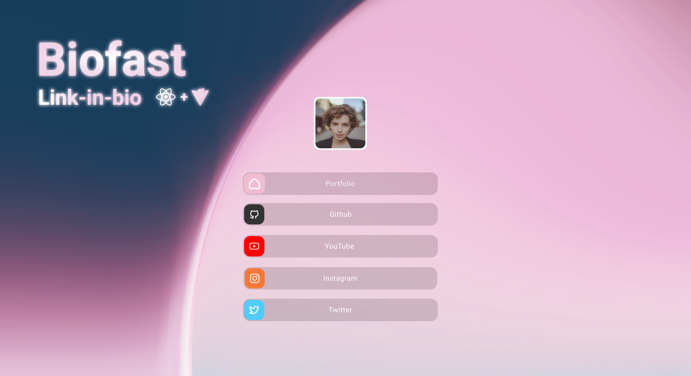
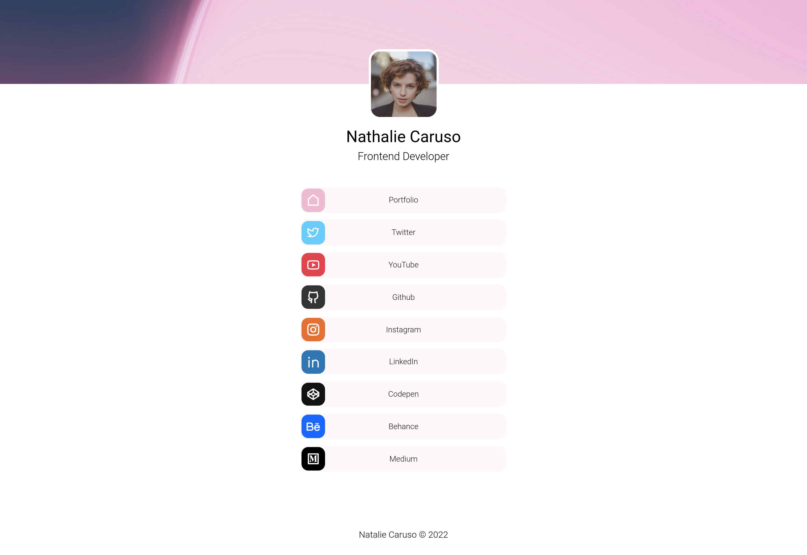

<h1 align="center">Biofast</h1>



<!-- TABLE OF CONTENTS -->

## Table of Contents

- [Overview](#overview)
  - [Built With](#built-with)
- [Features](#features)
- [Setup](#setup)
- [How to use](#how-to-use)
- [Build & deploy](#build--deploy)
- [License](#license)
- [Contact](#contact)

<!-- OVERVIEW -->

## Overview



### Built With

<!-- This section should list any major frameworks that you built your project using. Here are a few examples.-->

- [React](https://reactjs.org/)

## Features

A link-in-bio template easy to use

## Setup

<!-- For example: -->

To clone and run this application, you'll need [Git](https://git-scm.com) and [Node.js](https://nodejs.org/en/download/) (which comes with [npm](http://npmjs.com)) installed on your computer. From your command line:

```bash
# Clone this repository
$ git clone https://github.com/josnethmoreno/biofast.git

# Install dependencies
$ npm install

# Run the app
$ npm dev
```

## How to use

- Open the file index.html and replace <title>Biofast</title> with <title>Your Name</title>
- Open the file src/data.js and make changes.
- Replace image files src/assets/background.png and src/assets/photo.png

## Build & deploy

1. Generate a full static production build
   ```sh
   npm run build
   ```
2. Preview the site as it will appear once deployed
   ```sh
   npm run preview
   ```

## License

Distributed under the MIT License. See `LICENSE.txt` for more information.

## Contact

- Website [josnethmoreno.vercel.app](https://josnethmoreno.vercel.app)
- GitHub [@josnethmoreno](https://github.com/josnethmoreno)
- Linkedin [@josnethmoreno](https://linkedin.com/in/josnethmoreno)
